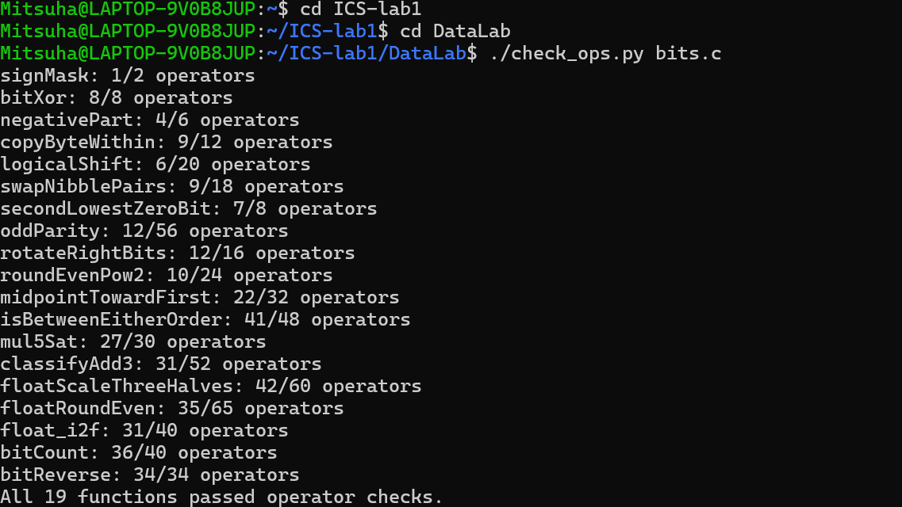
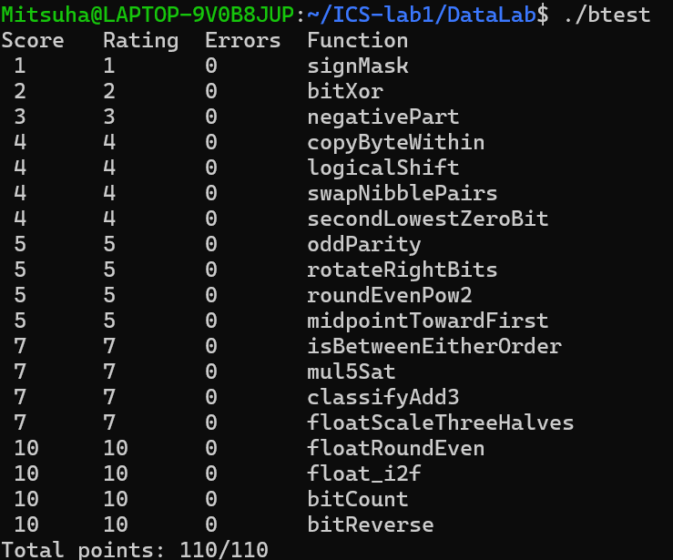

# Data Lab 实验报告

- **实验标题**：CS:APP Data Lab —— 位级运算与 IEEE 754 浮点数实验
- **姓名**：____________
- **学号**：____________
- **实验日期**：2026-10-08

---

## 一、实验目的

通过受限的整数运算与 IEEE 754 单精度浮点数的位级操作，深入理解二进制补码、位掩码、移位、溢出、饱和运算以及浮点数舍入等概念，掌握在不使用高级控制结构的前提下，用基本位运算实现复杂功能的方法。

---

## 二、实验环境

- 操作系统：Linux（x86-64，支持 32 位编译）
- 编译器：gcc（`-m32 -fwrapv`）
- 检查工具：`dlc`（通过 `check_ops.py` 调用）、`btest`

---

## 三、实验结果

### 3.1 运行 `./check_ops.py bits.c` 的结果

### 3.2 运行 `./btest` 的结果

实验最终得分 **110/110**，全部 19 个函数通过操作符合法性检查与正确性测试。

---

## 四、各函数实现思路

### P1 `signMask`（1 分，2 ops）
返回只有最高位为 1 的掩码。直接把常量 `1` 左移 31 位，得到 `0x80000000`。`-m32 -fwrapv` 下左移进入符号位按位向量模型解释，结果确定。

### P2 `bitXor`（2 分，8 ops）
只用 `~` 和 `&` 实现异或。先用 `x & ~y` 与 `~x & y` 得到"仅一方为 1"的两部分，再利用德摩根定律 `A | B = ~(~A & ~B)` 把按位或转成与非，得到
`~(~(x & ~y) & ~(~x & y))`。

### P3 `negativePart`（3 分，6 ops）
当 `x < 0` 时返回 `-x`，否则返回 0。用算术右移 `x >> 31` 得到全 1 / 全 0 的符号掩码，`~x + 1` 得到补码相反数，再与掩码相与实现二选一。

### P4 `copyByteWithin`（4 分，12 ops）
把字节序号乘 8 换算成位偏移，取出源字节 `(x >> (src<<3)) & 0xFF`；用 `~(0xFF << (dst<<3))` 清空目标字节，再把取出的字节左移到目标位置后按位或回原值。

### P5 `logicalShift`（4 分，20 ops）
机器上 `x >> n` 是算术右移。构造掩码 `~(((1 << 31) >> n) << 1)`，其低 `32-n` 位为 1、高位为 0，用它与 `(x >> n)` 相与即可把算术右移补入的高位 1 清零，实现逻辑右移。

### P6 `swapNibblePairs`（4 分，18 ops）
交换每个字节内的高低 4 位。用 `0x0F` 逐级复制构造掩码 `0x0F0F0F0F`，`(x & mask) << 4` 把低半字节移至高半字节，`(x >> 4) & mask` 把高半字节移回低半字节，再相或。

### P7 `secondLowestZeroBit`（4 分，8 ops）
找"第二低的 0 位"等价于在 `w = ~x` 中找第二低的 1 位。先用 `w & (w + ~0)`（即 `w & (w-1)`）清掉最低的 1，再对结果用 `t & (~t + 1)`（即 `t & -t`）隔离出最低的 1，即为原 x 中第二低的 0 位。少于两个 0 时自然返回 0。

### P8 `oddParity`（5 分，56 ops）
通过逐层折叠异或把 32 位的奇偶性汇聚到最低位：依次与右移 16、8、4、2、1 位的结果异或。折叠后最低位为 1 表示 1 的个数为奇数，最后 `!(x & 1)` 取反，满足"偶数个 1 返回 1、奇数个返回 0"。

### P9 `rotateRightBits`（5 分，16 ops）
循环右移。`shift = n & 31` 得到实际移位量；右半部分用逻辑右移（带掩码），左半部分把移出的低 `shift` 位通过 `x << ((~shift+1) & 31)` 补到高位，两部分相或。`(~shift+1) & 31` 即 `(32 - shift) mod 32`。

### P10 `roundEvenPow2`（5 分，24 ops）
把"舍入到最近偶数倍"转化为"加偏置后向下截断"。令 `half = 2^(n-1)`、商 `q = x >> n`，偏置 `bias = half - 1 + (q & 1)`。余数小于一半时不进位、大于一半时进位、恰好一半时按商的奇偶决定是否进位，最后 `((x+bias) >> n) << n` 截断。

### P11 `midpointTowardFirst`（5 分，32 ops）
`base = (x & y) + ((x ^ y) >> 1)` 是无溢出的 `floor((x+y)/2)`。当 `x+y` 为奇数（`(x^y)&1`）且 `x > y` 时结果再加 1，取更靠近 x 的整数。`x > y` 用符号位技巧（同号看 `x-y` 符号、异号看 x 符号）避免减法溢出。

### P12 `isBetweenEitherOrder`（7 分，48 ops）
先用无溢出的有符号比较把端点排序成 `min`、`max`，再把问题化为 `min <= x <= max`，即 `x >= min` 且 `max >= x`。有符号比较通过符号位（同号看差符号、异号看被比较数符号）实现，避免溢出。

### P13 `mul5Sat`（7 分，30 ops）
`5x` 正溢出当且仅当 `x > INT_MAX/5 = 0x19999999`，负溢出当且仅当 `x < -0x19999999`。用 0~255 的小常量移位构造阈值 `T`，正溢出条件 `x >= 0` 且 `x + ~T >= 0`（即 `x > T`），负溢出条件 `x < 0` 且 `x + T < 0`。用掩码选择无溢出时返回 `5x`、正溢出返回 `INT_MAX`、负溢出返回 `INT_MIN`。

### P14 `classifyAdd3`（7 分，52 ops）
分两次加法记录每一步的溢出方向：正溢出（两非负数和为负）、负溢出（两负数和为非负）分别用符号位判断。三次相加的数学和最多只越过一次边界，故有正向越过则返回 1、负向越过则返回 -1、一正一负抵消或均无则返回 0。

### P15 `floatScaleThreeHalves`（7 分，60 ops）
按位实现 `f * 3/2`。拆分符号、阶码、尾数；`exp == 0xFF`（NaN/无穷）直接返回。非规格化时对 `frac` 算 `3*frac/2` 并做舍入、必要时规格化。规格化时用完整有效数 `M = 2^23 + frac`，计算 `3M` 后按位宽除以 2 或 4，并做 round-to-nearest-even（恰好一半时看商奇偶），阶码溢出则返回无穷，符号位始终保留。

### P16 `floatRoundEven`（10 分，65 ops）
把浮点数舍入到最近整数（半程向偶数）。`exp < 127` 表示绝对值小于 1，只有 `exp == 126 && frac != 0`（即大于 0.5）时结果为 ±1.0，否则为 ±0（保留符号）。`E >= 23` 时已是整数直接返回；否则把有效数 `M` 拆成整数部分与小数部分，按小数部分与半程的大小关系、以及"恰好一半看整数奇偶"完成向偶数舍入，进位跨到下一幂次时阶码加 1。

### P17 `float_i2f`（10 分，40 ops）
把 `int` 转成单精度浮点位模式。特判 0；符号位取 `x & 0x80000000`；负数用 `~x + 1u`（无符号运算）取绝对值，可正确处理 `INT_MIN`。用循环数出位数 `E` 得到阶码 `E-1+127`；`E > 24` 时舍去低位，`round_bit`（被舍去的最高位）与 `sticky`（其余低位是否有 1）共同决定是否按 round-to-nearest-even 进位；进位导致 24 位溢出时阶码加 1、尾数清 0。

### P18 `bitCount`（10 分，40 ops）
统计 1 的个数，采用"分治逐级累加"。用 0~255 的小常量构造掩码 `0x55555555`、`0x33333333`、`0x0F0F0F0F`、`0x00FF00FF`、`0x0000FFFF`，依次 `(x & mask) + ((x >> k) & mask)` 把每 2 位、4 位、8 位、16 位、32 位的计数逐级合并。

### P19 `bitReverse`（10 分，34 ops）
反转 32 位。前 3 步用掩码 `0x55555555`、`0x33333333`、`0x0F0F0F0F` 交换相邻位、2 位组、4 位组，使每个字节内部位序反转。掩码用链式推导：`m3 = 0x0F0F0F0F`，`m2 = m3 ^ (m3 << 2)`，`m1 = m2 ^ (m2 << 1)`。最后用一个 4 项公式反转字节顺序，且其中两项共用掩码 `0xFF00`，使总操作数恰好压到上限 34。

---

## 五、参考文献与资料

1. Randal E. Bryant, David R. O'Hallaron. *Computer Systems: A Programmer's Perspective (CS:APP)*, 3rd Edition. Chapter 2（信息的表示与处理）.
2. 课程 Data Lab 实验讲义（`README.md`、`bits.c` 文件头部编码规则）.
3. Sean Eron Anderson. *Bit Twiddling Hacks*, Stanford University. （位计数、位反转等常见位运算技巧） https://graphics.stanford.edu/~seander/bithacks.html
4. Henry S. Warren. *Hacker's Delight*, 2nd Edition. （位反转、循环移位、饱和算术等）

> 注：以上资料用于学习二进制补码、位掩码、移位、溢出与舍入等基础概念及常见位运算技巧。
